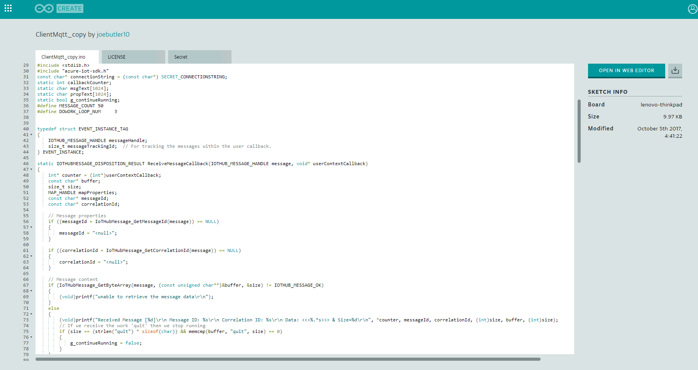

## What you'll learn
In this tutorial you will learn how to publish data to the Azure cloud using MQTT.  You will then read the data using the Device Explorer application.

## Gather your materials
UP Squared Board
Grove Pi+* board
Grove* Rotary Angle Sensor
Grove* LED

## Setup device explorer

The easiest way to view your data is either using the Device Explorer GUI application (for Windows)

1. Download and install the **SetupDeviceExplorer.msi** : https://github.com/Azure/azure-iot-sdk-csharp/releases/download/2017-9-8/SetupDeviceExplorer.msi

2. Enter the following connection string into the **IoT Hub Connection String** field in the Configuration tab of the application.  

```
HostName=my-iot-hub55.azure-devices.net;SharedAccessKeyName=iothubowner;SharedAccessKey=bTezHqMDbhxy6fkGW09sXLCB6pYbAd9p7qZ0zAdiOEg=
```

Then click **Update**.  You should see a popup confirming that it was successful.


3. Go to the **Management** tab.


4. Click **Create** and enter a Device ID, for example "test-device".  The Primary and Secondary keys should have populated automatically.


5. Right click on the device you just created, and select **Copy connection string for selected device**


## Edit example in Arduino Create

1. Open the example **Libraries>AZURE IOT DEVICE SDK>Examples>ClientMqtt**



2. Copy the connection string from step #5 above into the Secret tab of the sketch.


3. Build and Upload the sketch.

## View the data
Go to the **Data** tab and click **Monitor**.  You should see a message saying "Receiving events" or similar.  This is where you will see messages once your application is running on your target.


